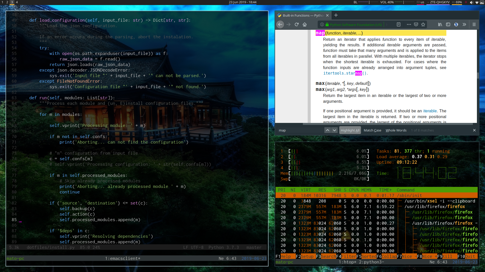

# My personal dotfiles
Current default configuration consists of:

- arch/manjaro
- sway {waybar, rofi, lightdm}
- fish {alacritty, urxvt, tmux}
- emacs [Doom!](https://github.com/hlissner/doom-emacs)
- ranger

You can see preview in


More screenshots can be found in this [folder](screenshots).

# Installation

First step is to clone this repository:

```bash
git clone https://www.github.com/metiu07/dotfiles
```

The repository contains installation scripts. Namely:

- install.py
- install.sh # deprecated

The [requirements.txt](requirements.txt) file contains arch package names of used packages. I am
trying to keep the list updated, but if something is missing simple google query
should find you the right package.

## Script - install.py

This is new and intended way to install dotfiles. To run this script at least
python version 3.5 is needed. Example usage is shown in the next snippet.

```bash
./install.py                 # install default target (linux)
./install.py bash            # install bash module
./install.py -r bash         # remove bash module
./install.py linux           # install linux target
./install.py -l              # list all modules
./install.py -i asd.json asd # use custom json configuration file
./install.py -d linux        # dry run (show user the command which will be run)
./install.py -m linux        # install via moving instead of symlink
./install.py -a linux        # auto-confirm all prompts
```

The program configuration is stored in json file `configuration.json`. For
example next snippet means that the file `./.config/ranger/rc.conf` will be
installed to the location `./.config/ranger/rc.conf` and also depends on module
`ragner_rifle`.

```json
  "ranger": {
    "source": "./.config/ranger/rc.conf",
    "destination": "~/.config/ranger/rc.conf",
    "name": "Ranger configuration",
    "install": "./scripts/install.sh",
    "$deps": [
      "ranger_rifle"
    ]
  }
```

## Script - install.sh

This script is deprecated and should not be used anymore. It's included only
because of nostalgia and for educational purposes.

## FAQ
### How to setup default applications

```bash
xdg-mime default org.pwmt.zathura.desktop application/pdf
```

### Sway

#### How to change tty

Press `ctrl` + `alt` + `cmd` + `fX` key.

### Firefox

#### Fullscreen - don't hide the toolbar

1) Go to `about:config` in firefox
2) Set the `browser.fullscreen.autohide` to `false`

#### Wayland

```bash
mkdir -p ~/.local/share/applications
# Setup for rofi
cp /usr/share/applications/firefox.desktop ~/.local/share/applications
# Every "Exec=..." prefix with "Exec=env MOZ_ENABLE_WAYLAND=1 ..."
# Correct links from applications
# NOTE: firefox.desktop is only a name, not a file path
xdg-settings set default-web-browser firefox.desktop
```

### Mac keyboard - fn keys

```bash
# Permanent
echo "options hid_apple fnmode=2" | sudo tee /etc/modprobe.d/hid_apple.conf
mkinitcpio -p linux

# Temporary
echo 2 | sudo tee /sys/module/hid_apple/parameters/fnmode
```

## Inspiration

This wouldn't have been possible without other people who share their dotfiles. Take this as a list of my appreciation and inspiration.

|Name/Link|Note|
|-|-|
|https://github.com/valebes/nix-dotfiles | |
|https://gitlab.com/JoelDimbernat/rofi-menus | |
|https://github.com/davidpdrsn| |
|https://github.com/LukeSmithxyz/voidrice | |
|https://github.com/s3rvac/dotfiles | |
|https://github.com/metthal/configs | |
|https://github.com/geohot/configuration | |
|https://github.com/okubax/dotfiles | |
|https://github.com/089kili/dotfiles | | 
|https://github.com/Madic-/Sway-DE | |
